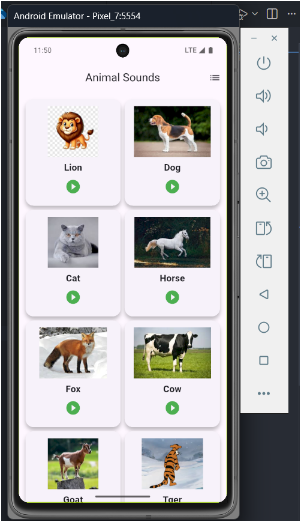
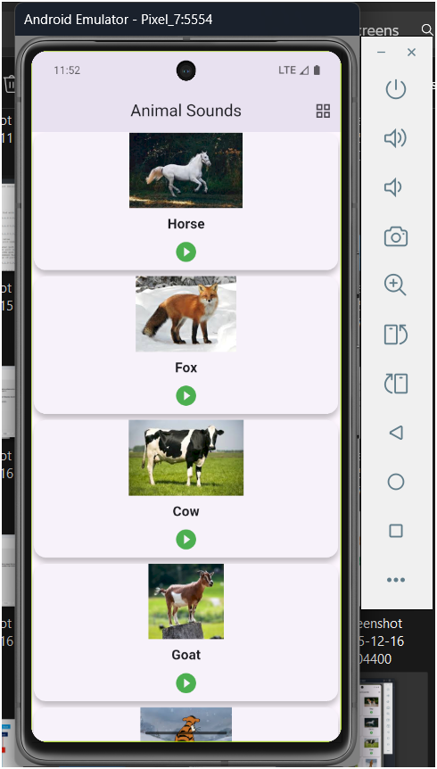

# Flutter Animal Sounds Assignment

This project is a Flutter application that demonstrates a clean and modern UI design for playing animal sounds.

## 📱 App Overview

The application contains:
- Grid and List view toggle for animal cards
- Each card displays:
  - Animal image
  - Animal name
  - Play button for sound
- Responsive UI for different screen sizes
- Assets loaded from JSON file for dynamic content

The UI is clean, modern, and follows Flutter best practices.

## 🖼️ App Output

Below are screenshots of the application:

### List View
<p align="center">
  
  
</p>

### Grid View
<p align="center">
  
  
</p>

## 🛠️ Technologies Used

- Flutter
- Dart
- Material Design
- AudioPlayers package
- JSON for local data storage

## 🚀 How to Run the Project

```bash
git clone https://github.com/MostafaTonin/assignment2.git
cd assginment2
flutter pub get
flutter run
